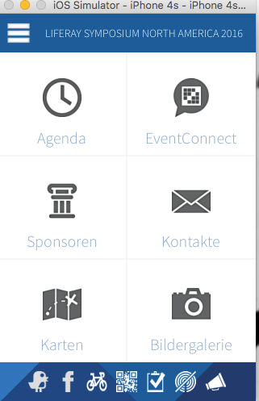
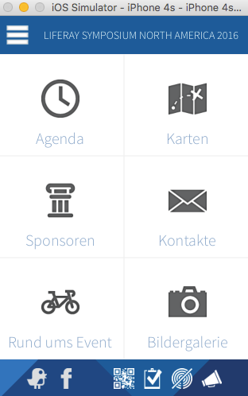

# Events App

## Front / Menu Screen

Once an active event has been selected, the front / menu screen is shown. Depending on how the event is configured, the Event Connect feature may or may not be enabled. 

The following menu items are shown: 

- Agenda
- Event Connect or Maps, if Event Connect disabled
- Sponsors
- Contacts
- Maps or Activities, if Event Connect disabled
- Gallery

Here is how the menu looks with EventConnect enabled:

    

Here is how the menu looks with EventConnect disabled:

    

