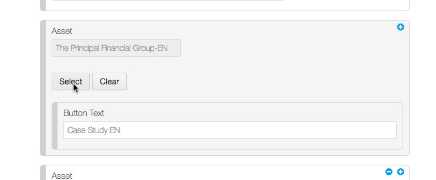
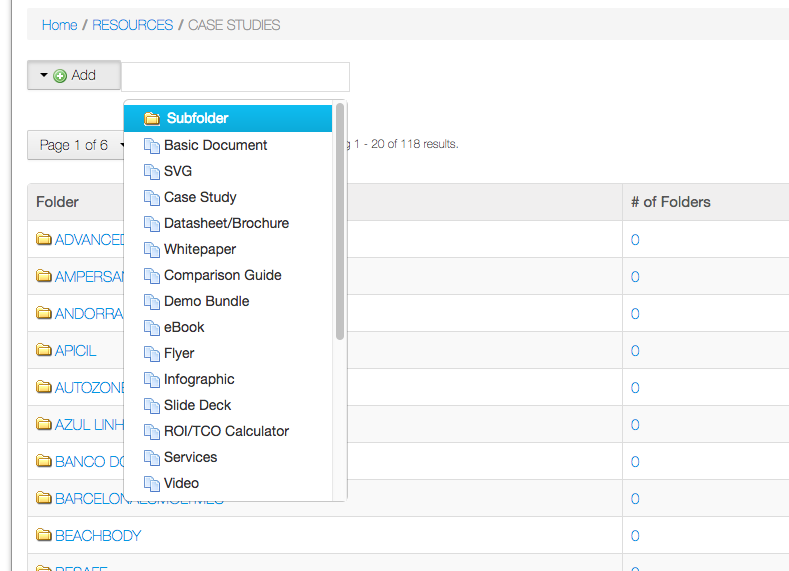
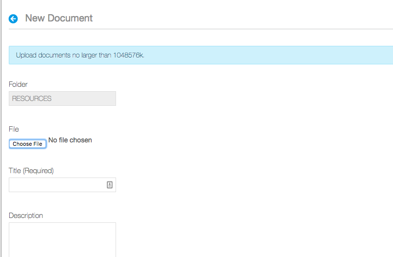
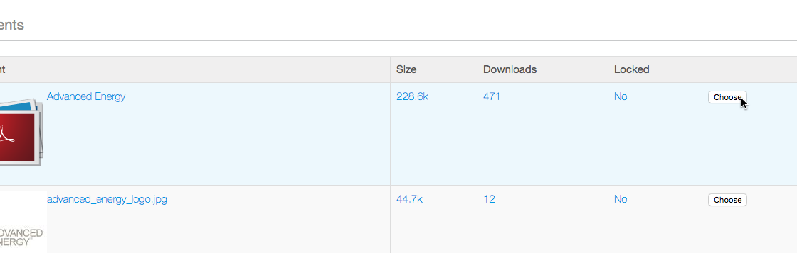
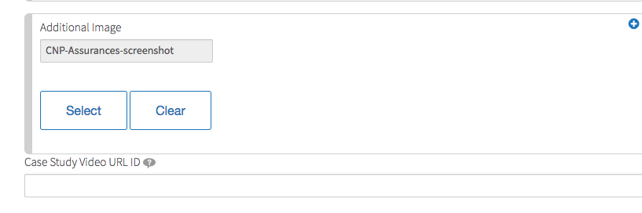

# Case Studies
> Case studies are an important marketing piece for Liferay's web presence. Here's how to add them quickly.

## Adding a Case Study
1. Log in and Go to Control Panel.
2. Go to Web Content and Navigate to > **Web Content > RESOURCES > CASE STUDIES.**

    
    3. Click **Add > Case Study**.

    
    4. Fill out case study page according to this guide:

    
    5. We need to provide the company summary shown on the Resources home page...

    
    6. ...by going to **Abstract** and filling out **Summary** information.

    
    7. Categorize the Case Study by hitting the **Categorization** Tab.
    <ul>
        <li>Category List Filter: Resources</li>
        <li>Industries</li>
        <li>Locations</li>
        <li>Resource Types: Case Studies</li>
        <li>Solutions</li>
    </ul>       

## Upload Assets, e.g. PDFs (optional):

    
    1. Select **Select** in **Asset** section and navigate to **Resources > Case Studies**

    
    2. If the company for your case study already exists, navigate to that folder. Otherwise, create a new folder in all caps by selecting **Add > Subfolder**.

    
    3. In that folder, select Add > Basic Document and upload your asset. No categorization is necessary. Click **Publish** when done uploading asset.

    
    4. Choose the asset

## Company Logo for Case Study
If you need a logo for the case study, create a ticket for Design to provide one. Here are some guidelines for working with the Design team:

- Please get an SVG or PNG, whichever will have a smaller size.
- Request logo be size of 226x64 or view box size of 0 0 226 64

## Making Logos Visible on Resources Page
To make Case Study logos visible on the Resources page, check the box **Featured** when editing/adding a case study.

## Setting a Screenshot to Be Main Image

    
    To have a screenshot featured on the case study page instead of the company logo, specify the image in the section **Additional Image**.

## Case Studies with Videos

    
    If the case study has a video, add the YouTube link to the field **Case Study Video URL ID**.

## Finishing Up

    
    When everything is done in the steps above, hit publish.

