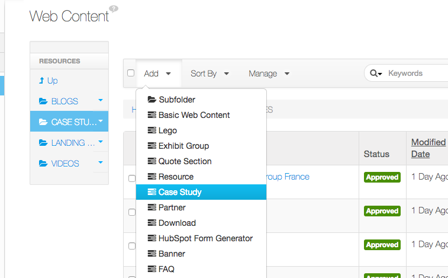
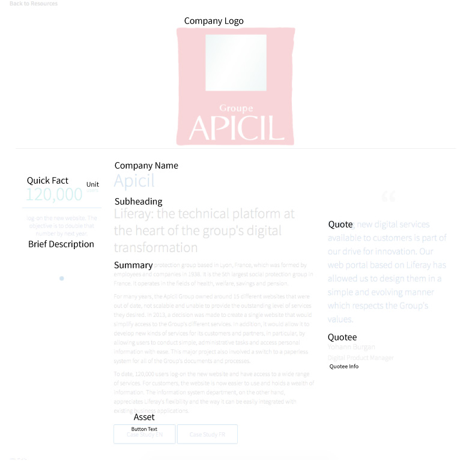
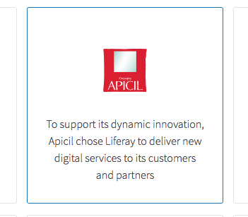
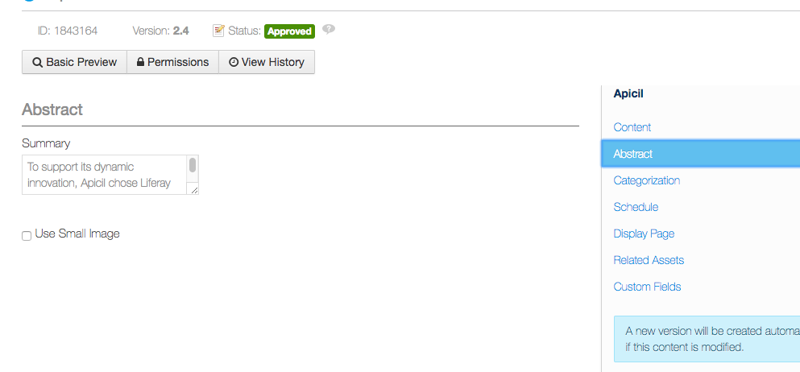
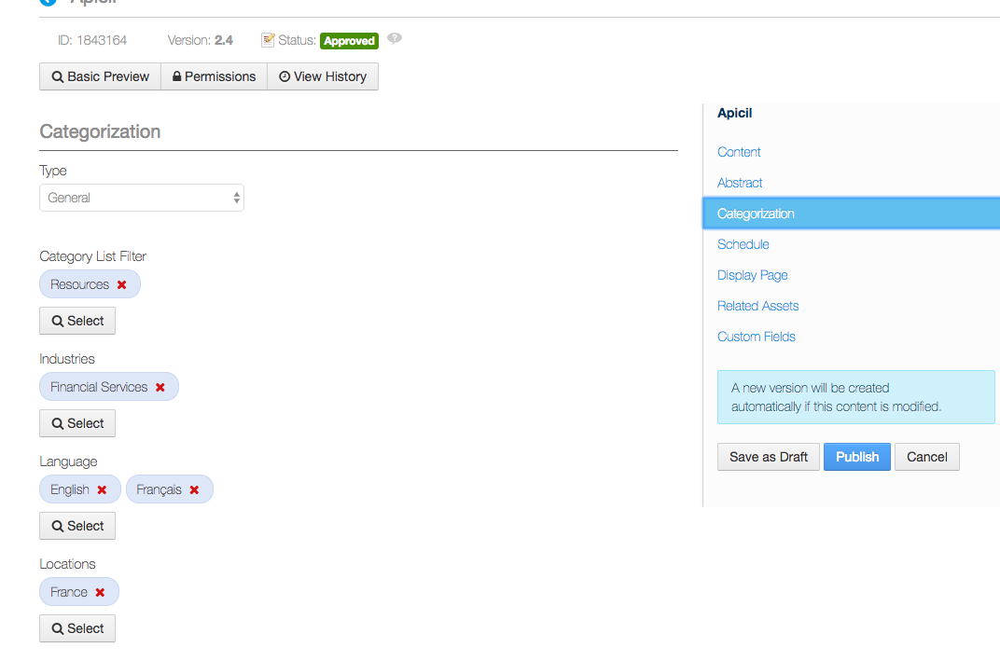
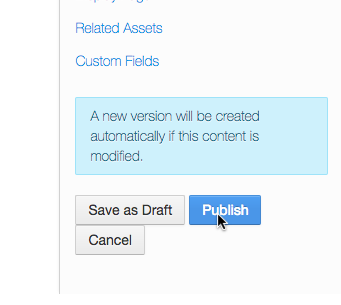
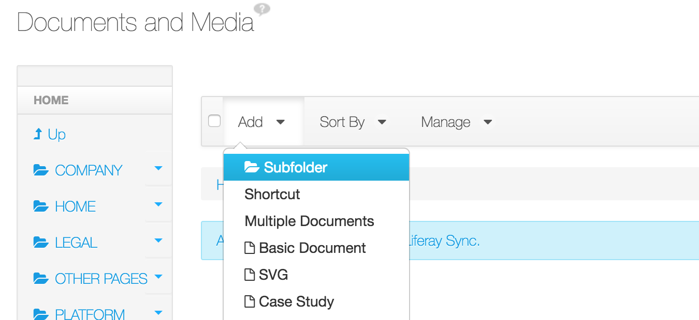
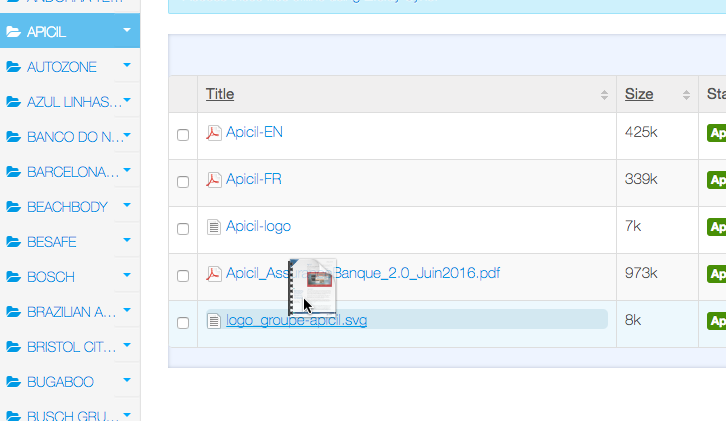
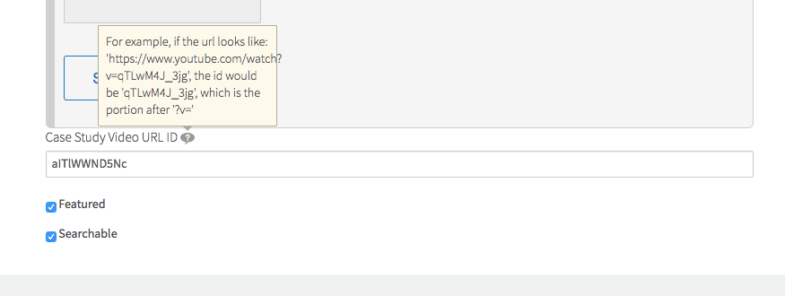

# Case Studies
> Case studies are an important marketing piece to Liferay's web presence. Here's how to add them quickly.

## Adding a Case Study
1. Login and Go In Control Panel
2. Go to Web Content and Navigate to > Web Content > RESOURCES > CASE STUDIES

    
    3. Clicking Add > Case Study

    
    4. Fill out case study page according to this guide:

    
    5. We need to provide the company summary shown in Resources home page...

    
    6. ...by going to Abstract and filling out Summary information

    
    7. Categorize the Case Study
    
    <ul>
        <li>Category List Filter: Resources</li>
        <li>Industries</li>
        <li>Locations</li>
        <li>Resource Types: Case Studies</li>
        <li>Solutions</li>
    </ul>
       

    
    8. Hit Publish

## Company Logo for Case Study
If you need a logo for case study, create a ticket for Design to provide one. Here's some information to provide Design team

- Please get an SVG versus PNG if the overall size of the image will be less. 
- Request logo be: size of 226x64 - or view box size of 0 0 226 64

## Uploading Case Studies PDFs
In order to add an asset e.g. to the Case Study, you need to first upload it in the Document library to make it available for us.

1. Login
2. In Control Panel, in **Documents and Media** and Navigate to Resources > Case Studies

    
    3. If the company for your case study already exists, navigate to there. Otherwise, create a new folder in all caps by selected Add > Subfolder

    
    4. Upload your PDF by either 1) dragging and dropping files in or 2) Add > Basic Document

The asset should now be available for use when you are adding a Case Study

## Case Studies with Videos

    
    If the case study has a video, add the YouTube link to the field “Case Study Video URL ID”.

